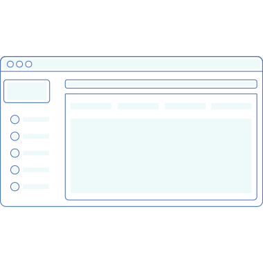

Dashboard Experience
=============

**Dasboard Experience** é um dashbaord minimalista, com uma interface amigável e pensado na usabilidade.

	Este projeto foi gerado com [CLI Angular] versao 6.1.1
  
## Front do projeto

Para o front-end do projeto foi utilizado o experience UI, meu framework com componentes simples e bonitos. 

## Servidor de desenvolvimento

Execute `ng serve` para um servidor dev. Navegue até `http: // localhost: 4200 /`. O aplicativo será recarregado automaticamente se você alterar qualquer um dos arquivos de origem.

## Build

BuildRun `ng build` para construir o projeto. Os artefatos de construção serão armazenados no diretório `dist /`. Use o sinalizador `--prod` para uma construção de produção.

## Running unit tests

Run `ng test` to execute the unit tests via [Karma](https://karma-runner.github.io).

## Running end-to-end tests

Run `ng e2e` to execute the end-to-end tests via [Protractor](http://www.protractortest.org/).

